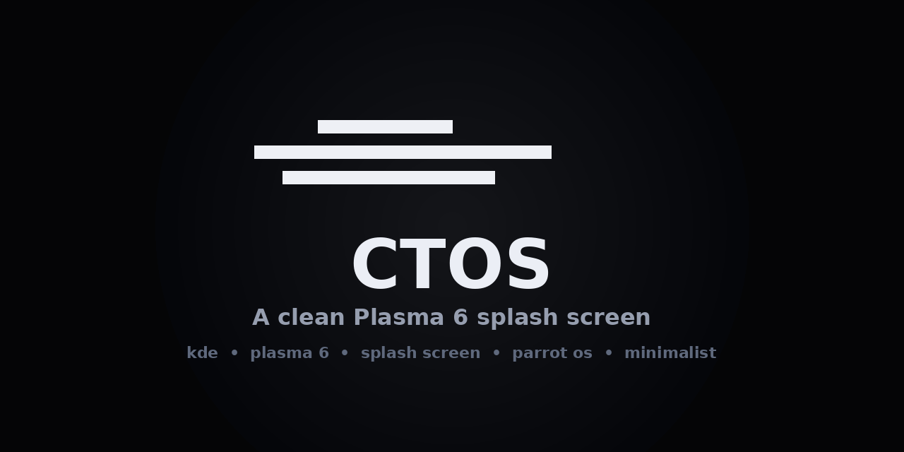

<div align="center">



# CTOS — Plasma 6 Splash Screen

A clean, minimalist splash screen for **KDE Plasma 6** inspired by the ctOS boot sequence from *Watch Dogs*.

Just the animation on a pure black background. **No logos. No branding text. No spinner.**

</div>

---

## Why

The default Parrot Security splash shows a nice CTOS-style animation — but it also stamps a **"Welcome to Parrot Security"** banner and the Parrot logo at the bottom. This theme strips all of that away and keeps only the animation, on a clean black screen.

It ships as a standalone Plasma Look-and-Feel package, so it shows up as its own entry named **CTOS** in your Splash Screen settings.

## Preview

<div align="center">
<table>
<tr>
<td align="center"><b>Splash screen</b><br/></td>
<td align="center"><b>What gets removed</b><br/><sub>The bottom "Welcome to Parrot Security" text and logo are gone.</sub></td>
</tr>
</table>
</div>

## Requirements

- KDE Plasma **6** (Plasma 5 is not supported — the QML uses Plasma 6 APIs)

Check your version:

```bash
plasmashell --version
```

## Install

Pick whichever method you're comfortable with.

### Method 1 — One-line script (recommended)

```bash
curl -fsSL https://raw.githubusercontent.com/debarch777/ctos-plasma-splash/main/install.sh -o /tmp/ctos-install.sh && bash /tmp/ctos-install.sh
```

### Method 2 — Manual (download .zip)

1. Go to **[Releases](https://github.com/debarch777/ctos-plasma-splash/releases)**
2. Download `CTOS.zip` (or download the `src/CTOS` folder from **Code → Download ZIP**)
3. Unzip so you have a folder called `CTOS` containing `metadata.json` and `contents/`
4. Move it into place:
   ```bash
   mv CTOS ~/.local/share/plasma/look-and-feel/
   ```

### Method 3 — Git clone

```bash
git clone https://github.com/debarch777/ctos-plasma-splash.git
cp -r ctos-plasma-splash/src/CTOS ~/.local/share/plasma/look-and-feel/
```

## Activate

After installing with any method above:

1. Open **System Settings → Appearance → Splash Screen**
2. If **CTOS** doesn't appear yet, restart Plasma so it rescans:
   ```bash
   kquitapp6 plasmashell && kstart plasmashell
   ```
   (or just log out and back in)
3. Select **CTOS** → **Apply**
4. Hit the **Test** button to preview without rebooting

## Uninstall

```bash
rm -rf ~/.local/share/plasma/look-and-feel/CTOS
```
Then pick a different splash in System Settings.

## How it works

The theme is a Plasma Look-and-Feel package. The interesting file is
[`src/CTOS/contents/splash/Splash.qml`](src/CTOS/contents/splash/Splash.qml) —
it's just a fullscreen black `Rectangle` with a centered `AnimatedImage` playing
`animation.gif`. That's it. The original Parrot theme's bottom Row (text + logo)
and the busy spinner were removed.

Tweak freely:

- **Change the animation** — replace `src/CTOS/contents/splash/images/animation.gif`
- **Change the size** — edit the `sizeAnim: 704` value in `Splash.qml`
- **Background color** — change `color: "#000"` in `Splash.qml`

## File structure

```
ctos-plasma-splash/
├── src/
│   └── CTOS/                          ← the installable theme folder
│       ├── metadata.json              ← theme id/name (shows as "CTOS")
│       └── contents/
│           ├── previews/
│           │   └── splash.png         ← thumbnail in settings
│           └── splash/
│               ├── Splash.qml         ← the layout (black + centered gif)
│               └── images/
│                   └── animation.gif  ← the CTOS-style animation
├── install.sh                         ← one-line installer
├── assets/                            ← repo graphics (preview, social card)
└── README.md
```

## Credits & License

This theme is a derived work. The original animation, layout, and concept come
from the **[Parrot Security](https://gitlab.com/parrotsec/packages/parrot-core)**
splash screen by the Parrot team (Lorenzo Faletra) and ferretwithaberet.

- Animation artwork © its respective authors
- Code (`Splash.qml`) licensed under **GPLv2+** (inherited from the original)
- The `CTOS` name references the fictional operating system from Ubisoft's
  *Watch Dogs*; this project is not affiliated with or endorsed by Parrot,
  KDE, or Ubisoft.

## Acknowledgements

- [Parrot Security](https://www.parrotsec.org/) — original theme
- [KDE Plasma](https://kde.org/plasma-desktop/) — the desktop this beautifies
